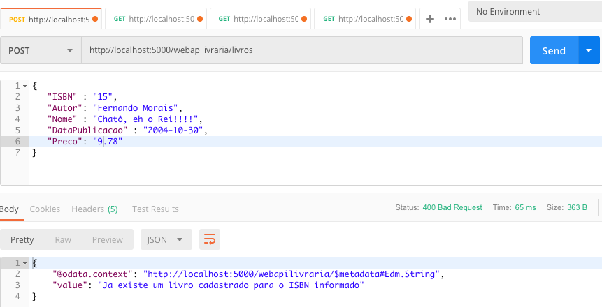

# WebApiLivraria

Projeto que ilustra a criação de uma WebApi para controle de Entidades do Tipo "Livro".

# Dependências

Microsoft.NETCore.App (2.1.0)

Microsoft.AspNetCore.App (2.1.1)

Microsoft.AspNetCore.OData (7.1.0)

# Ferramentas

Microsoft Visual Studio 2017

Postman (https://www.getpostman.com) para realizar testes na WebApi desenvolvida

# OData (Open Data Protocol)

Corresponde a um protocolo aberto que permite a criação e o consumo de APIs RESTful consultáveis e interoperáveis de maneira simples e padrão.

Proposto pela Microsoft, sua documentação detalhada pode ser encontrada em (https://www.odata.org/documentation/).

Uma das principais convenções deste protocolo é o <b>Query Options</b>, o que possibilita tornar as APIs flexíveis.

<b>Query Options</b> é usado para definir como uma API vai entregar os dados, permitindo construir dinâmicamente pesquisas através de filtros, realizar ordenações, projeções, entre outras coisas.


Exemplo:


Resumidamente, o que foi habilitado para se utilizar neste projeto:

<ul>
	<li>filter: Montagem de consultas dinâmicas a partir de atributo do <i>POCO</i> Livro</li>
	<li>orderby: Ordenção a partir de atribuitos da mesma entidade</li>
	<li>skip: Controle de paginação</li>
</ul>

# Explicação do projeto

[Startup.cs](https://github.com/newtoncarvalho/desafio_dot_net/blob/master/WebApiLivraria/WebApiLivraria/Startup.cs)

```C#
        public void ConfigureServices(IServiceCollection services)
        {
            /**
             * Usando Sintaxe similar ao Lambada expression do Java
             * Vamos especificar o tipo de provedor de banco de dados
             * Neste caso, usaremos apenas o Banco de Dados em Memória
             */
            services.AddDbContext<LivroDbContext>(options =>
                options.UseInMemoryDatabase("LivrariaDB"));

            // Injetando dependencia do framework OData
            services.AddOData();

            // Injetando dependencia do framework AspNet MVC
            services.AddMvc().SetCompatibilityVersion(CompatibilityVersion.Version_2_1);

            // URIs sem caso sensitivo
            services.AddSingleton(sp => new ODataUriResolver {EnableCaseInsensitive = true});
            
        }

        // This method gets called by the runtime. Use this method to configure the HTTP request pipeline.
        public void Configure(IApplicationBuilder app, IHostingEnvironment env)
        {
            if (env.IsDevelopment())
            {
                app.UseDeveloperExceptionPage();
            }
            else
            {
                app.UseHsts();
            }

            //app.UseHttpsRedirection();

            /**
             * Configurando OData endpoint
             * MapODataServiceRoute => Declarando existencia de um EndPoint
             */
            //app.UseMvc(builder => builder.MapODataServiceRoute("odata", "apilivraria", GetEdmModel()));
            app.UseMvc(ConfigureODataRoutes);
        }

        private static void ConfigureODataRoutes(Microsoft.AspNetCore.Routing.IRouteBuilder routes)
        {
            var model = GetEdmModel();
            routes.MapODataServiceRoute("ODataRoute", "webapilivraria", model);
            routes.Filter(QueryOptionSetting.Allowed); // Permite o comando $filter
            routes.OrderBy(); // Permite o comando $orderby
            routes.Count(); // Permite o comando $count
            routes.Select(); // Permite o comando $select
        }

        /*
         * Gerando Entity Database Model que sera utilizado pelo OData e pelo
         * EntityManager
         */
        private static IEdmModel GetEdmModel()
        {
            var builder = new ODataConventionModelBuilder();
            builder.EntitySet<Livro>("Livros");
            return builder.GetEdmModel();
        }
```

No arquivo Startup.cs, convencionamento que será utilizado o OData, bem como no Singleton para ODataUriResolver, definindo que teremos um tratamento Case Insensitive para URLs.

No método Configure, mais precisamente em ConfigureODataRoutes, é definido a rota ODataRoute, com prefixo "webapilivraria" (o prefixo que será chamado na URL). Essa rota é baseada em um Model pré-definido, criado a partir do método GetEdmModel. 

Tal método informa quais entidades (EntitySet) serão utilizadas. No nosso caso será apenas a entidade <b>Livro</b>, vide em [Livro.cs](https://github.com/newtoncarvalho/desafio_dot_net/tree/master/WebApiLivraria/WebApiLivraria) .

As outras definições (Filter, OrderBy, Count e Select) indicam as respectivas operações que serão suportadas.

[LivroController.cs](https://github.com/newtoncarvalho/desafio_dot_net/blob/master/WebApiLivraria/WebApiLivraria/Controllers/LivrosController.cs)

```C#
    [EnableQuery(PageSize =5)]
    public class LivrosController : ODataController
    {
        private readonly LivroDbContext livroDdContext;

        public LivrosController(LivroDbContext dbContext)
        {
            this.livroDdContext = dbContext;
        }

        [HttpGet]
        public IQueryable<Livro> Get()
        {
            IQueryable<Livro> query = livroDdContext.Livros.AsQueryable();
            return query;
        }

        [HttpGet]
        public IActionResult Get([FromODataUri] String key)
        {
            if (string.IsNullOrWhiteSpace(key))
                return BadRequest("ISBN parametro obrigatorio");

            Livro livroPersistido = this.livroDdContext.Livros.FirstOrDefault(l => l.ISBN == key);
            if (livroPersistido == null)
                return NotFound("Nao existe livro cadastrado para o ISBN informado [" + key + "]");

            return Ok(livroPersistido);
        }


        [HttpPost]
        public IActionResult Post([FromBody]Livro livro)
        {
            // Analisa o objeto informado
            if (!ModelState.IsValid)
            {
                return BadRequest(ModelState);
            }

            String key = livro.ISBN;
            if (string.IsNullOrWhiteSpace(key))
                return BadRequest("ISBN parametro obrigatorio");

            if (key.Length > 13)
                return BadRequest("Comprimento ISBN nao pode ser superior a 13 caracteres");
         
            Livro livroPersistido = this.livroDdContext.Livros.FirstOrDefault(l => l.ISBN == key);
            if (livroPersistido != null)
                return BadRequest("Ja existe um livro cadastrado para o ISBN informado");

            this.livroDdContext.Livros.Add(livro);
            this.livroDdContext.SaveChangesAsync();

            /**
             * O primeiro parametro corresponde a uma URI de retorno
             * Ja o segundo e o Bean propriamente dito
             */
            return Created($"?key={livro.ISBN}", livro);            
        }

        [HttpPut]
        public IActionResult Put([FromODataUri] String key, [FromBody]Livro livro)
        {
            // Analisa o objeto informado
            if (!ModelState.IsValid)
            {
                return BadRequest(ModelState);
            }

            Livro livroPersistido = this.livroDdContext.Livros.FirstOrDefault(l => l.ISBN == key);
            if (livroPersistido == null)
                return NotFound("Nao existe livro cadastrado para o ISBN informado [" + key + "]");

            /**
             * A entidade ja existe no Banco, Portanto ja estah (tracked) "amarrado" no
             * contexto de persistencia
             */

            livroPersistido.Autor = livro.Autor;
            livroPersistido.DataPublicacao = livro.DataPublicacao;
            livroPersistido.Nome = livro.Nome;
            livroPersistido.Preco = livro.Preco;

            this.livroDdContext.SaveChangesAsync();

            return Updated(livro);
        }

        [HttpDelete]
        public IActionResult Delete([FromODataUri] String key)
        {
            Livro livro = this.livroDdContext.Livros.FirstOrDefault(l => l.ISBN == key);
            if (livro == null)
                return NotFound("Livro nao encontrado para o ISBN informado");

            this.livroDdContext.Remove(livro);
            this.livroDdContext.SaveChangesAsync();
            return StatusCode((int)System.Net.HttpStatusCode.NoContent);
        }
    }
```

Em LivroController.cs são definidas e implementadas as actions da API. O atributo <b>[EnableQuery]</b>, definindo PageSize=5, possibilita que a paginação já venha habilitada por padrão (O valor "5" foi utilizado apenas para testar paginação com poucos registros).

Os métodos que utilizam Id (GET e PUT) apresentam uma particularidade: A obrigatoriedade de substituir o nome de parâmetro 'id' (padrão do WebAPI) por 'key', pois caso contrário o OData não reconhece a Action.

# Ilustrando Metadados

A partir da URL http://localhost:5000/webapilivraria/$metadata é possível obter os metadados da WebApi.

No caso da entidade Livro, a chave é definida pelo atributo (string) ISBN.

Nas proximas seções serão exemplificadas as chamadas realizadas a partir da Ferramenta Postman.

# Ilustrando Chamadas GET


##### Obtendo livro pelo chave (ISBN) '8'


##### Tentando Obtenr livro sem passar uma chave (ISBN)


##### Tentando Obtenr livro passando chave (ISBN) não cadastrada


# Ilustrando Chamadas GET com Filtragem e Ordenação

##### Obtendo todos os livros (Vide Paginação)


##### Obtendo livros usando <b>filter</b> e <b>orderby</b>

<ul>
	<li>$filter: Demonstra consulta aplicada dinâmicamente através dos atributos <b>NomeAutor</b> e   <b>DataPublicacao</b></li>
	<li>$orderby: Ordenação dos regisgros</li>
</ul>
As Consultas seguem os padrão de queries utilizando a sintaxe do LINQ


Outra Consulta: Utlizando <b>Preco</b>, <b>DataPublicacao</b> e <b>Autor</b>


A consultas dinâmicas são realizadas através de um objeto do tipo IQueryable.

# Ilustrando Chamadas POST

##### Inserindo


##### Tentando inserir ISBN repetido


# Ilustrando Chamada PUT

##### Atualizando (Necessário informar ISBN como parâmetro da URI, neste exemplo '8')


# Ilustrando Chamada DELETE

##### Informando ISBN como parâmetro da URI (Neste exemplo, novamente '8')


##### Informando ISBN não cadastrado


